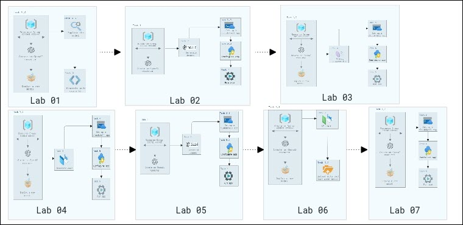
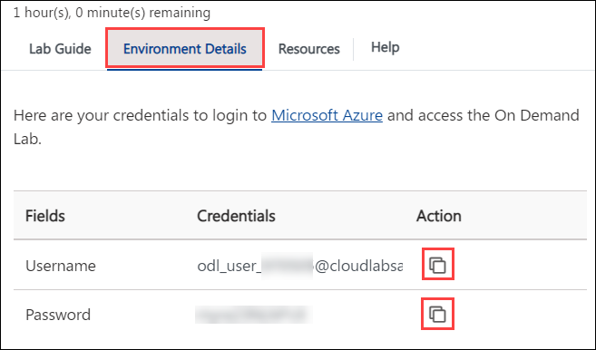
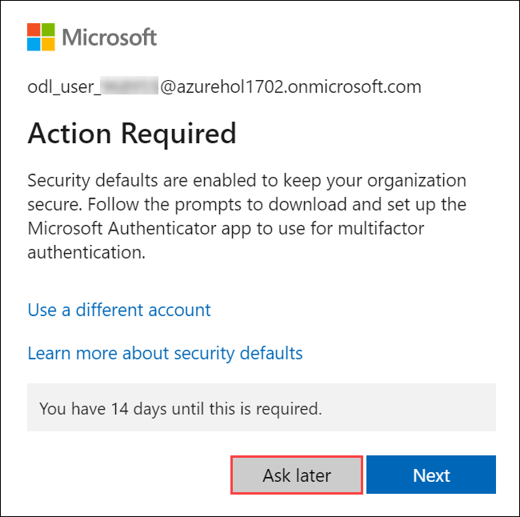

# Develop Generative AI solutions with Azure OpenAI Service
### Overall Estimated Duration: 8 Hours
### Overview

These hands-on labs provide a full introduction to the Azure OpenAI Service. You'll start by configuring the service, then incorporate the Azure OpenAI SDKs into your application. Prompt engineering techniques will help you refine interactions while also teaching you how to generate and enhance code. The DALL-E model will be used to generate images, and you will experiment with adding your own data for retrieval-augmented generation (RAG). Finally, you'll learn about content filtering, which allows you to govern and regulate generated outputs.

## Objective 

This lab is aimed to give learners hands-on experience with Azure OpenAI resources, deploy and explore models using the Completions and Chat playgrounds, and experiment with prompts, parameters, and code generation. By completing

In this lab, participants will learn:

1. **Get started with the Azure OpenAI Service**: This hands-on exercise aims to teach you the fundamentals of using Azure OpenAI Service to integrate advanced AI models into your apps. Participants will set up and begin utilizing the Azure OpenAI Service to integrate AI models into their applications.

2. **Use Azure OpenAI SDKs in your app**: This hands-on exercise demonstrates how to integrate Azure OpenAI SDKs into your application to improve AI capabilities. Participants will integrate and use Azure OpenAI SDKs within their application.

3. **Utilize prompt engineering in your app**: This hands-on exercise demonstrates how to use prompt engineering methods to improve AI interactions in your application. Participants will use prompt engineering strategies to enhance the performance and relevance of AI.

4. **Generate and improve code with Azure OpenAI Service**: The goal of this hands-on exercise is to demonstrate how to effectively generate and refine code using Azure OpenAI. Participants will improve their abilities to create and refine code with Azure OpenAI Service tools and approaches.

5. **Generate images with a DALL-E model**: The goal of this hands-on activity is to produce and alter images using the DALL-E model. To attain the intended visual results, participants will develop and alter images using the DALL-E model.

6. **Add your data for RAG using Azure OpenAI Service**: This hands-on exercise will help you integrate your data with the Azure OpenAI Service for Retrieval-Augmented Generation (RAG) to improve AI responses. Participants will integrate data into the Azure OpenAI Service to boost AI-powered retrieval and generation.

7. **Explore content filters in Azure OpenAI**: This hands-on exercise demonstrates how to construct and maintain content filters in Azure OpenAI to control and refine generated outputs. Participants will learn about and implement content filters in Azure OpenAI to control and refine created material.

### Prerequisites
Participants should have:

1. **Development Skills**: Basic programming knowledge and experience with APIs and SDKs.
2. **AI Concepts**: Understanding prompt engineering, code development, and image generation using models such as DALL-E.
3. **Content Management**: Understanding data integration for RAG and content filtering techniques.
   
### Architecture

These laboratories use the Azure OpenAI Service API to interface with models, Azure SDKs for application integration, and Azure Storage solutions to manage data and outcomes. You will also use prompt engineering and content filters to refine and safeguard the results.

### Architecture Diagram

### Explanation of Components

 1.**Azure OpenAI**: Integrates your data with large language models, enabling customized and secure interactions. 
 2.**Azure OpenAI Models**: Offers pre-trained and customizable large language models for various AI applications. 
 3.**Azure CloudShell**: Provides an online, browser-based shell for managing Azure resources and running scripts. 
 4.**DALL-e**: DALL-E generates images from textual descriptions using AI technology. 
 5.**Prompt Engeneering**: Prompt engineering refines input prompts to improve AI model responses. 

## Getting Started with Lab

1. Once the environment is provisioned, a virtual machine (JumpVM) and lab guide will get loaded in your browser. Use this virtual machine throughout the workshop to perform the lab. You can see the number on the lab guide bottom area to switch to different exercises of the lab guide.

   
   
1. To get the lab environment details, you can select the **Environment Details** tab. Additionally, the credentials will also be emailed to your email address provided during registration. You can start, stop, and restart virtual machines from the **Resources** tab.

   

## Login to Azure Portal
1. In the JumpVM, click on Azure portal shortcut of Microsoft Edge browser which is created on desktop.

   
   
1. On **Sign into Microsoft Azure** tab you will see login screen, in that enter following email/username and then click on **Next**. 
   * Email/Username: <inject key="AzureAdUserEmail"></inject>
   
     
     
1. Now enter the following password and click on **Sign in**.
   * Password: <inject key="AzureAdUserPassword"></inject>
   
     
     
1. If you see the pop-up **Action Required**, click **Ask Later**.

     
     
    > If you are getting popup **save password**, then select **Save & Turn on** option.
       
1. If you see the pop-up **Stay Signed in?**, click **No**.

1. If you see the pop-up **You have free Azure Advisor recommendations!**, close the window to continue the lab.

1. If a **Welcome to Microsoft Azure** popup window appears, click **Maybe Later** to skip the tour.

1. Now you will see Azure Portal Dashboard, click on **Resource groups** from the Navigate panel to see the resource groups.

     

1. Confirm you have a resource group **openai-<inject key="Deployment-id" enableCopy="false"/>** present as shown in the below screenshot. You need to use the **openai-<inject key="Deployment-id" enableCopy="false"/>** resource group throughout the entire process of lab execution.

     
   
1. Use **Next** button from lower right corner to move on to the next page.

   

This hands-on lab empowers participants to master Azure OpenAI Service by guiding them through setup, SDK integration, and prompt engineering. It also covers code generation, image creation with DALL-E, RAG data integration, and content filtering for comprehensive learning.

### Happy learning !
