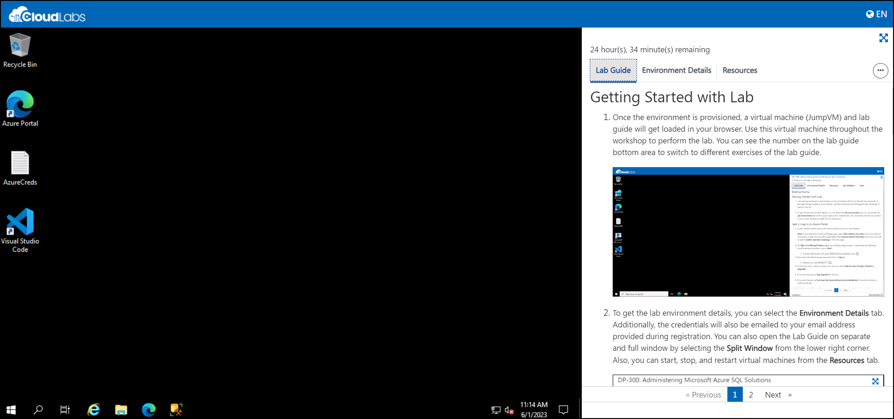

# Develop Generative AI solutions with Azure OpenAI Service
### Overall Estimated Duration: 8 Hours
### Overview

These hands on lab provide a comprehensive introduction to Azure OpenAI Service. You’ll begin by setting up the service and then integrate Azure OpenAI SDKs into your application. Techniques in prompt engineering will help refine interactions, while you’ll also learn to generate and enhance code. The DALL-E model will be used for image generation, and you'll explore adding your data for retrieval-augmented generation (RAG). Lastly, you’ll delve into content filtering to manage and control generated outputs.

## Objective 

This lab is designed to equip participants with hands-on experience in Azure OpenAI resource, deploy and explore models using the Completions and Chat playgrounds, and experiment with prompts, parameters, and code generation By completing this lab, participants will learn to:

1. **Get started with Azure OpenAI Service**:  This hands-on exercise aims to Explore the basics of leveraging Azure OpenAI Service for integrating advanced AI models into your applications. Participants will Set up and begin using Azure OpenAI Service to implement AI models in your projects.

2. **Use Azure OpenAI SDKs in your app**: This hands-on exercise aims how to integrate Azure OpenAI SDKs into your application for enhanced AI capabilities. Participants will integrate and utilize Azure OpenAI SDKs within the application.

3. **Utilize prompt engineering in your app**:This hands-on exercise aims how to apply prompt engineering techniques to optimize AI interactions in your application. Participants will effectively apply prompt engineering techniques to improve the performance and relevance of AI responses in the application.

4. **Generate and improve code with Azure OpenAI Service**:This hands-on exercise aims to use Azure OpenAI Service to generate and refine code effectively. Participants will Enhance their ability to generate and refine code using Azure OpenAI Service tools and techniques.

5. **Generate images with a DALL-E model**:This hands-on exercise aims to create and manipulate images using the DALL-E model. Participants will create and customize images using the DALL-E model to achieve desired visual outcomes.

6. **Add your data for RAG with Azure OpenAI Service**:This hands-on exercise aims to Integrate your data with Azure OpenAI Service for Retrieval-Augmented Generation (RAG) to enhance AI responses. Participants will integrate data into Azure OpenAI Service for improved AI-driven retrieval and generation.

7. **Explore content filters in Azure OpenAI**:This hands-on exercise aims to implement and manage content filters in Azure OpenAI to control and refine generated outputs. Participants will Understand and implement content filters in Azure OpenAI to manage and refine the generated content.

### Prerequisites

Participants should have:

1. **Development Skills:** Basic programming knowledge and familiarity with APIs and SDKs.
2. **AI Concepts:** Understanding of prompt engineering, code generation, and image generation with models like DALL-E.
3. **Content Management:** Knowledge of data integration for RAG and content filtering techniques.

### Architecture

These labs leverage the Azure OpenAI Service API for interacting with models, Azure SDKs for application integration, and Azure storage solutions for managing data and results. You'll also apply prompt engineering and content filters to refine and secure the outputs.

## Getting Started with Lab

1. Once the environment is provisioned, a virtual machine (JumpVM) and lab guide will get loaded in your browser. Use this virtual machine throughout the workshop to perform the lab. You can see the number on the lab guide bottom area to switch to different exercises of the lab guide.

   
   
1. To get the lab environment details, you can select the **Environment Details** tab. Additionally, the credentials will also be emailed to your email address provided during registration. You can start, stop, and restart virtual machines from the **Resources** tab.

   

## Login to Azure Portal
1. In the JumpVM, click on Azure portal shortcut of Microsoft Edge browser which is created on desktop.

   
   
1. On **Sign into Microsoft Azure** tab you will see login screen, in that enter following email/username and then click on **Next**. 
   * Email/Username: <inject key="AzureAdUserEmail"></inject>
   
     
     
1. Now enter the following password and click on **Sign in**.
   * Password: <inject key="AzureAdUserPassword"></inject>
   
     
     
1. If you see the pop-up **Action Required**, click **Ask Later**.

     
     
    > If you are getting popup **save password**, then select **Save & Turn on** option.
       
1. If you see the pop-up **Stay Signed in?**, click **No**.

1. If you see the pop-up **You have free Azure Advisor recommendations!**, close the window to continue the lab.

1. If a **Welcome to Microsoft Azure** popup window appears, click **Maybe Later** to skip the tour.

1. Now you will see Azure Portal Dashboard, click on **Resource groups** from the Navigate panel to see the resource groups.

     

1. Confirm you have a resource group **openai-<inject key="Deployment-id" enableCopy="false"/>** present as shown in the below screenshot. You need to use the **openai-<inject key="Deployment-id" enableCopy="false"/>** resource group throughout the entire process of lab execution.

     
   
1. Use **Next** button from lower right corner to move on to the next page.

   

This hands-on lab empowers participants to master Azure OpenAI Service by guiding them through setup, SDK integration, and prompt engineering. It also covers code generation, image creation with DALL-E, RAG data integration, and content filtering for comprehensive learning.

### Happy learning !
