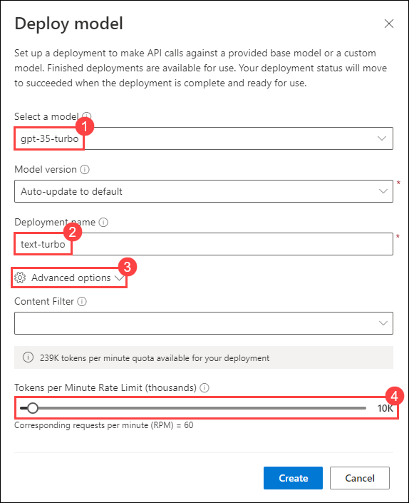
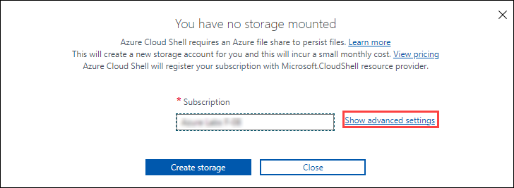

# Lab 02: Integrate Azure OpenAI into your app

## Lab scenario
With the Azure OpenAI Service, developers can create chatbots, language models, and other applications that excel at understanding natural human language. The Azure OpenAI provides access to pre-trained AI models, as well as a suite of APIs and tools for customizing and fine-tuning these models to meet the specific requirements of your application. In this exercise, you'll learn how to deploy a model in Azure OpenAI and use it in your own application to summarize text.

## Lab objectives
In this lab, you will complete the following tasks:

- Task 1: Provision an Azure OpenAI resource
- Task 2: Deploy a model
- Task 3: Set up an application in Cloud Shell
- Task 4: Configure your application
- Task 5: Run your application

## Estimated time: 40 minutes

### Task 1: Provision an Azure OpenAI resource

Before you can use Azure OpenAI models, you must provision an Azure OpenAI resource in your Azure subscription.

1. In the **Azure portal**, search for **OpenAI** and select **Azure OpenAI**.

   

2. On **Azure AI Services | Azure OpenAI** blade, click on **Create**.

   

3. create an **Azure OpenAI** resource with the following settings:
    - **Subscription**: Default - Pre-assigned subscription.
    - **Resource group**: openai-<inject key="Deployment-id" enableCopy="false"></inject>
    - **Region**: Select <inject key="Region" enableCopy="false" />
    - **Name**: OpenAI-Lab02-<inject key="Deployment-id" enableCopy="false"></inject>
    - **Pricing tier**: Standard S0
      
   

4. Wait for deployment to complete. Then go to the deployed Azure OpenAI resource in the Azure portal.

5. To capture the Keys and Endpoints values, on **openai-<inject key="Deployment-id" enableCopy="false"></inject>** blade:
      - Select **Keys and Endpoint (1)** under **Resource Management**.
      - Click on **Show Keys (2)**.
      - Copy **Key 1 (3)** and ensure to paste it in a text editor such as notepad for future reference.
      - Finally copy the **Endpoint (4)** API URL by clicking on copy to clipboard. Paste it in a text editor such as notepad for later use.

   

  **Congratulations** on completing the task! Now, it's time to validate it. Here are the steps:

  > - Navigate to the Lab Validation tab, from the upper right corner in the lab guide section.
  > - Hit the Validate button for the corresponding task. If you receive a success message, you can proceed to the next task. 
  > - If not, carefully read the error message and retry the step, following the instructions in the lab guide.
  > - If you need any assistance, please contact us at labs-support@spektrasystems.com.

### Task 2: Deploy a model

To use the Azure OpenAI API, you must first deploy a model to use through the **Azure OpenAI Studio**. Once deployed, we will reference that model in our app.

1. In the **Azure portal**, search for **OpenAI** and select **Azure OpenAI**.

   

2. On **Azure AI Services | Azure OpenAI** blade, select **OpenAI-Lab02-<inject key="Deployment-id" enableCopy="false"></inject>**

   

3. In the Azure OpenAI resource pane, click on **Go to Azure OpenAI Studio** it will navaigate to **Azure AI Studio**.

   

4. In **Welcome to Azure OpenAI Service** page, click on **Create new deployment**.

   

5. In the **Deployments** page, click on **+ Create new deployment**.
    
   

6. Within the **Deploy model** pop-up interface, enter the following details and then click on **Advanced options (3)** followed by scaling down the **Tokens per Minute Rate Limit (thousands) (4)**:
    - **Select a model**: gpt-35-turbo
    - **Model version**: *Use the default version*
    - **Deployment name**: text-turbo
    - **Tokens per Minute Rate Limit (thousands)**: 10K
  
   

7. Click on the **Create** button to deploy a model which you will be playing around with as you proceed.

> **Note**: Each Azure OpenAI model is optimized for a different balance of capabilities and performance. We'll use the **3.5 Turbo** model series in the **GPT-3** model family in this exercise, which is highly capable for language understanding. This exercise only uses a single model, however deployment and usage of other models you deploy will work in the same way.

  **Congratulations** on completing the task! Now, it's time to validate it. Here are the steps:

  > - Navigate to the Lab Validation tab, from the upper right corner in the lab guide section.
  > - Hit the Validate button for the corresponding task. If you receive a success message, you can proceed to the next task. 
  > - If not, carefully read the error message and retry the step, following the instructions in the lab guide.
  > - If you need any assistance, please contact us at labs-support@spektrasystems.com.

### Task 3: Set up an application in Cloud Shell

To show how to integrate with an Azure OpenAI model, we'll use a short command-line application that runs in Cloud Shell on Azure. Open up a new browser tab to work with Cloud Shell.

1. In the [Azure portal](https://portal.azure.com?azure-portal=true), select the **[>_]** (*Cloud Shell*) button at the top of the page to the right of the search box. A Cloud Shell pane will open at the bottom of the portal.

    

2. The first time you open the Cloud Shell, you may be prompted to choose the type of shell you want to use (*Bash* or *PowerShell*). Select **Bash**. If you don't see this option, skip the step.  

3. If you're prompted to create storage for your Cloud Shell, ensure your subscription is specified and then select **Advanced settings**.

   

4. Within the **Advanced settings** pane, enter the following details and then click on **Create storage**:
    - **Subscription**: Default- Choose the only existing subscription assigned for this lab.
    - **CloudShell region**: East US
    - **Resource group**: Select **Use existing**.
      - openai-<inject key="Deployment-id" enableCopy="false"></inject>
    - **Storage account**: Select **Create new**.
      - storage<inject key="Deployment-id" enableCopy="false"></inject>
    - **File share**: Create a new file share named **none**
  
   

5. Make sure the type of shell indicated on the top left of the Cloud Shell pane is switched to *Bash*. If it's *PowerShell*, switch to *Bash* by using the drop-down menu.

6. Note that you can resize the cloud shell by dragging the separator bar at the top of the pane, or by using the **&#8212;**, **&#9723;**, and **X** icons at the top right of the pane to minimize, maximize, and close the pane. For more information about using the Azure Cloud Shell, see the [Azure Cloud Shell documentation](https://docs.microsoft.com/azure/cloud-shell/overview). 

7. Once the terminal starts, enter the following command to download the sample application and save it to a folder called `azure-openai`.

    ```bash
   rm -r azure-openai -f
   git clone https://github.com/MicrosoftLearning/mslearn-openai azure-openai
    ```
  
8. The files are downloaded to a folder named **azure-openai**. Navigate to the lab files for this exercise using the following command.

    ```bash
   cd azure-openai/Labfiles/02-nlp-azure-openai
    ```

Applications for both C# and Python have been provided, as well as a sample text file you'll use to test the summarization. Both apps feature the same functionality.

Open the built-in code editor, and observe the text file that you'll be summarizing with your model located at `text-files/sample-text.txt`. Use the following command to open the lab files in the code editor.

```bash
code .
```

  **Congratulations** on completing the task! Now, it's time to validate it. Here are the steps:

  > - Navigate to the Lab Validation tab, from the upper right corner in the lab guide section.
  > - Hit the Validate button for the corresponding task. If you receive a success message, you can proceed to the next task. 
  > - If not, carefully read the error message and retry the step, following the instructions in the lab guide.
  > - If you need any assistance, please contact us at labs-support@spektrasystems.com.

### Task 4: Configure your application

For this exercise, you'll complete some key parts of the application to enable using your Azure OpenAI resource.

1. In the code editor, expand the **CSharp** or **Python** folder, depending on your language preference.

2. Open the configuration file for your language

    - C#: `appsettings.json`
    - Python: `.env`
    
3. Update the configuration values to include the **endpoint** and **key** from the Azure OpenAI resource you created, as well as the model name that you deployed, `text-turbo`. Then save the file by using the shortcut keys CTRL+S or CMD+S.

4. Navigate to the folder for your preferred language and install the necessary packages

    **C#**

    ```bash
   cd CSharp
   dotnet add package Azure.AI.OpenAI --prerelease
    ```

    **Python**

    ```bash
   cd Python
   pip install python-dotenv
   pip install openai
    ```

5. Navigate to your preferred language folder, select the code file, and add the necessary libraries.

    **C#**: Program.cs

    ```csharp
   // Add Azure OpenAI package
   using Azure.AI.OpenAI;
    ```

    **Python**: test-openai-model.py

    ```python
   # Add OpenAI import
   import openai
    ```

6. Open up the application code for your language and add the necessary code for building the request, which specifies the various parameters for your model such as `prompt` and `temperature`.

    **C#**: Program.cs

    ```csharp
   // Initialize the Azure OpenAI client
   OpenAIClient client = new OpenAIClient(new Uri(oaiEndpoint), new AzureKeyCredential(oaiKey));

   // Build completion options object
   ChatCompletionsOptions chatCompletionsOptions = new ChatCompletionsOptions()
   {
       Messages =
       {
          new ChatMessage(ChatRole.System, "You are a helpful assistant. Summarize the following text in 60 words or less."),
          new ChatMessage(ChatRole.User, text),
       },
       MaxTokens = 120,
       Temperature = 0.7f,
   };

   // Send request to Azure OpenAI model
   ChatCompletions response = client.GetChatCompletions(
       deploymentOrModelName: oaiModelName, 
       chatCompletionsOptions);
   string completion = response.Choices[0].Message.Content;

   Console.WriteLine("Summary: " + completion + "\n");
    ```

    **Python**: test-openai-model.py

    ```python
   # Set OpenAI configuration settings
   openai.api_type = "azure"
   openai.api_base = azure_oai_endpoint
   openai.api_version = "2023-03-15-preview"
   openai.api_key = azure_oai_key

   # Send request to Azure OpenAI model
   print("Sending request for summary to Azure OpenAI endpoint...\n\n")
   response = openai.ChatCompletion.create(
       engine=azure_oai_model,
       temperature=0.7,
       max_tokens=120,
       messages=[
          {"role": "system", "content": "You are a helpful assistant. Summarize the following text in 60 words or less."},
           {"role": "user", "content": text}
       ]
   )

   print("Summary: " + response.choices[0].message.content + "\n")
    ```
7. To save the changes made to the file, execute CTRL+S or CMD+S.

### Task 5: Run your application

Now that your app has been configured, run it to send your request to your model and observe the response.

1. In the Cloud Shell bash terminal, navigate to the folder for your preferred language.
1. Run the application.

    - **C#**: `dotnet run`
    - **Python**: `python test-openai-model.py`

1. Observe the summarization of the sample text file.
1. Navigate to your code file for your preferred language, and change the *temperature* value to `1`. Save the file.
1. Run the application again, and observe the output.

Increasing the temperature often causes the summary to vary, even when provided the same text, due to the increased randomness. You can run it several times to see how the output may change. Try using different values for your temperature with the same input.

## Review

In this lab, you have accomplished the following:
-   Provision an Azure OpenAI resource
-   Deploy an OpenAI model within the Azure OpenAI studio
-   Integrate Azure OpenAI models into your applications

### You have successfully completed the lab.
