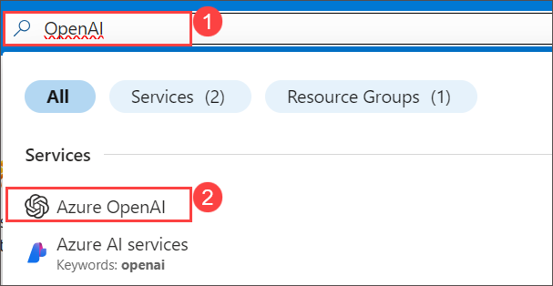
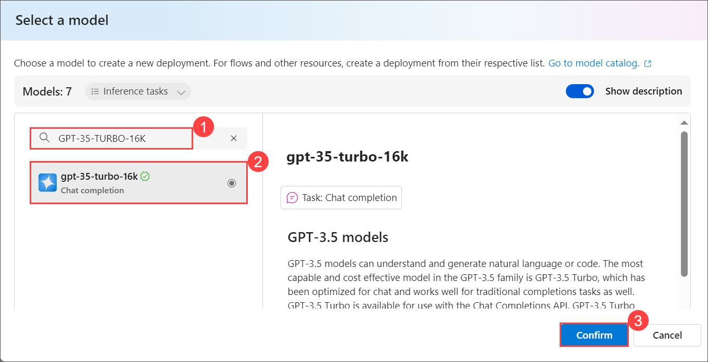
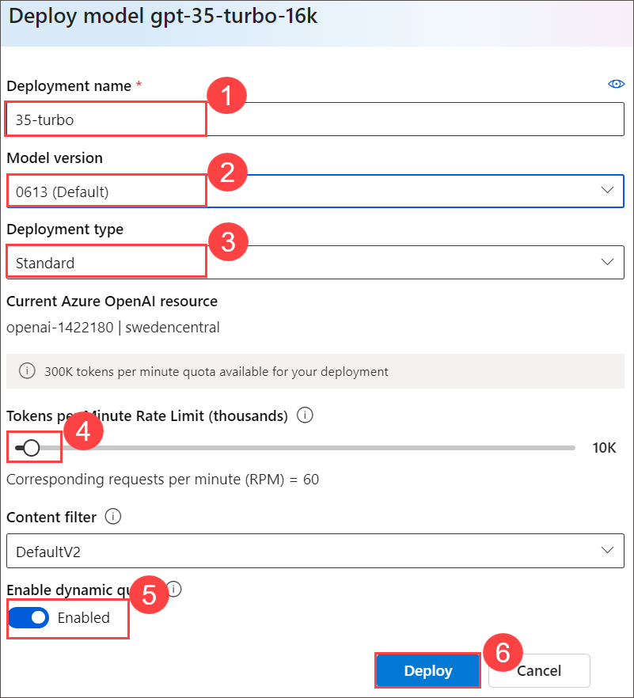
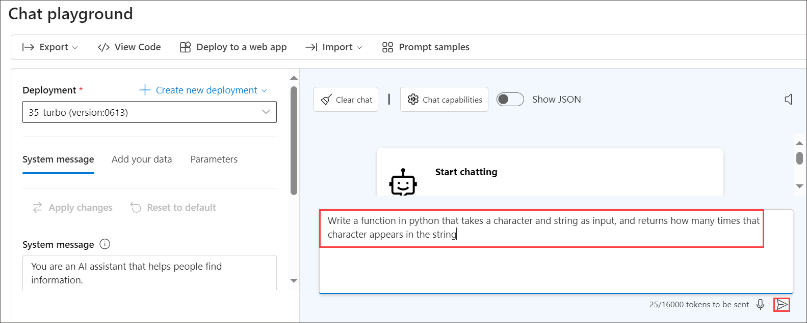
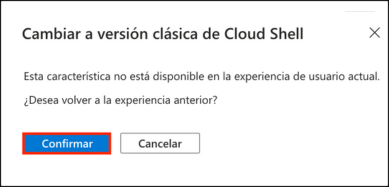

# Lab 01: Generate and improve code with Azure OpenAI Service

## Lab scenario
The Azure OpenAI Service models can generate code for you using natural language prompts, fixing bugs in completed code, and providing code comments. These models can also explain and simplify existing code to help you understand what it does and how to improve it.

## Lab objectives
In this lab, you will complete the following tasks:

- Task 1: Deploy a model
- Task 2: Generate code in chat playground
- Task 3: Set up an application in Cloud Shell
- Task 4: Configure your application
- Task 5: Run your application

## Estimated time: 60 minutes

### Task 1: Deploy a model

To use the Azure OpenAI API for code generation, you must first deploy a model to use through the **Azure OpenAI Studio**. Once deployed, we will use the model with the playground and reference that model in our app.

1. In the **Azure portal**, search for **OpenAI** and select **Azure OpenAI**.

   

1. On **Azure AI Services | Azure OpenAI** blade, select **OpenAI-Lab04-<inject key="DeploymentID" enableCopy="false"></inject>**

   

1. In the Azure OpenAI resource pane, click on **Go to Azure OpenAI Studio** it will navigate to **Azure AI Studio**.

   

1. In the prompt select **Explore the new experience** .

      

1. In the **Deployments (1)** page, click on **+ Deploy model** , Choose **Deploy base Model (2)**.

      

1. Search and select **GPT-35-TURBO-16K**, click on **Confirm**

      

   
1. Within the **Deploy model** pop-up interface, enter the following details:
    - **Deployment name**: 35-turbo (1)
    - **Select a Model**: accept default (2)
      
        >**Note** : gpt-35-turbo-16k is supported only for chat completions and it is not supported for completions API.<br>
    - **Deployment type**: Standard (3)
    - **Tokens per Minute Rate Limit (thousands)**: 10K (4)
    - **Enable dynamic quota**: Enabled (5)
    - Click on **Deploy** (6)
  
         

   > **Note**:You can ignore the "Failed to fetch deployments quota information" notification.

   > **Note**: Each Azure OpenAI model is optimized for a different balance of capabilities and performance. We'll use the **3.5 Turbo** model series in the **GPT-3** model family in this exercise, which is highly capable for both language and code understanding.

#### Validation

   <validation step="6b5dfe99-465f-46ee-87f2-cd43ea009266" />
   
   > **Congratulations** on completing the task! Now, it's time to validate it. Here are the steps:
   > - Hit the Validate button for the corresponding task. If you receive a success message, you can proceed to the next task. 
   > - If not, carefully read the error message and retry the step, following the instructions in the lab guide.
   > - If you need any assistance, please contact us at labs-support@spektrasystems.com. We are available 24/7 to help you out.


### Task 2: Generate code in chat playground

Before using in your app, examine how Azure OpenAI can generate and explain code in the chat playground.

1. In [Azure OpenAI Studio](https://oai.azure.com/?azure-portal=true), navigate to the **Chat** playground in the left pane.
   
2. In the **Setup** section at the top, select the **Default** (1) system message template and click on **continue**.

   
   
3. Scroll down and in the **Chat session** section, enter the following prompt and press *Enter*.

    ```code
   Write a function in python that takes a character and string as input, and returns how many times that character appears in the string
    ```

    

4. The model will likely respond with a function, with some explanation of what the function does and how to call it.
   
5. Next, send the prompt `Do the same thing, but this time write it in C#`.
   
6. Observe the output. The model likely responded very similarly as the first time, but this time coding in C#. You can ask it again for a different language of your choice, or a function to complete a different task such as reversing the input string.
   
7. Next, let's explore using AI to understand code. Submit the following prompt as the user message.

    ```code
    What does the following function do?  
    ---  
    def multiply(a, b):  
    result = 0  
    negative = False  
    if a < 0 and b > 0:  
        a = -a  
        negative = True  
    elif a > 0 and b < 0:  
        b = -b  
        negative = True  
    elif a < 0 and b < 0:  
        a = -a  
        b = -b  
    while b > 0:  
        result += a  
        b -= 1      
    if negative:  
        return -result  
    else:  
        return result
    ```

8. Observe the output, which explains what the function does, which is to multiply two numbers together by using a loop.

9. Submit the prompt `Can you simplify the function?`. The model should write a simpler version of the function.

10. Submit the prompt: `Add some comments to the function.` The model adds comments to the code.
    
### Task 3: Set up an application in Cloud Shell

To show how to integrate with an Azure OpenAI model, we'll use a short command-line application that runs in Cloud Shell on Azure. Open up a new browser tab to work with Cloud Shell.

1. In the [Azure portal](https://portal.azure.com?azure-portal=true), select the **[>_]** (*Cloud Shell*) button at the top of the page to the right of the search box. A Cloud Shell pane will open at the bottom of the portal.

    

2. Make sure the type of shell indicated on the top left of the Cloud Shell pane is switched to *Bash*. If it's *PowerShell*, switch to *Bash* by using the drop-down menu.

3. Once the terminal starts, enter the following command to download the sample application and save it to a folder called `azure-openai`.

    ```bash
   rm -r azure-openai -f
   git clone https://github.com/MicrosoftLearning/mslearn-openai azure-openai
    ```

    > **NOTE:** if you get Message saying already cloned , please move the next step.

4. The files are downloaded to a folder named **azure-openai**. Navigate to the lab files for this exercise using the following command.

    ```bash
   cd azure-openai/Labfiles/04-code-generation
    ```

   Applications for both C# and Python have been provided, as well as sample code we'll be using in this lab.

   Open the built-in code editor, and you can observe the code files we'll be using in `sample-code`. Use the following command to open the lab files in the code editor.

    ```bash
   code .
    ```
   > **NOTE:** If you're prompted to **Switch to Classic Cloud Shell** after running the **code .** command, click on **Confirm** and make sure you are in the correct project path.

   
5. Run the following command :

    ```bash
   cd azure-openai/Labfiles/04-code-generation
    ```


    ```bash
   code .
    ```

#### Validation

   <validation step="2a8f35b8-234c-4548-9951-579dc22af97f" />
   
   > **Congratulations** on completing the task! Now, it's time to validate it. Here are the steps:
   > - Hit the Validate button for the corresponding task. If you receive a success message, you can proceed to the next task. 
   > - If not, carefully read the error message and retry the step, following the instructions in the lab guide.
   > - If you need any assistance, please contact us at labs-support@spektrasystems.com. We are available 24/7 to help you out.


### Task 4: Configure your application

For this exercise, you'll complete some key parts of the application to enable using your Azure OpenAI resource.

1. In the code editor, expand the language folder for your preferred language.

2. Open the configuration file for your language.

    - **C#**: `appsettings.json`
    - **Python**: `.env`

3. Update the configuration values to include the **endpoint** and **key** from the Azure OpenAI resource you created, as well as the name of your deployment, `35turbo`. Then save the file by right-clicking on the file from the left pane and hit **Save**.

4. Navigate to the folder for your preferred language and install the necessary packages.

    **C#**

    ```bash
   cd CSharp
   dotnet add package Azure.AI.OpenAI --version 1.0.0-beta.14
    ```

    **Python**

      ```bash
    cd Python
    pip install python-dotenv
    pip install openai==1.13.3
    ```

5. open the code file for your preferred language. In the function that calls the Azure OpenAI model, under the comment **Format and send the request to the model**, add the code to format and send the request to the model.

    **C#**
    `Program.cs`

   ```csharp
     // Format and send the request to the model
       var chatCompletionsOptions = new ChatCompletionsOptions()
       {
           Messages =
           {
               new ChatRequestSystemMessage(systemPrompt),
               new ChatRequestUserMessage(userPrompt)
           },
           Temperature = 0.7f,
           MaxTokens = 1000,
           DeploymentName = oaiDeploymentName
       };
   
       // Get response from Azure OpenAI
       Response<ChatCompletions> response = await client.GetChatCompletionsAsync(chatCompletionsOptions);
   
       ChatCompletions completions = response.Value;
       string completion = completions.Choices[0].Message.Content;
    ```

    **Python**
     `code-generation.py`

      ```python
    # Format and send the request to the model
    messages =[
        {"role": "system", "content": system_message},
        {"role": "user", "content": user_message},
    ]
    
    # Call the Azure OpenAI model
    response = client.chat.completions.create(
        model=model,
        messages=messages,
        temperature=0.7,
        max_tokens=1000
    )
    ```

6. To save the changes made to the file, right-click on the file from the left pane, and hit **Save**

### Task 5: Run your application

Now that your app has been configured, run it to try generating code for each use case. The use case is numbered in the app, and can be run in any order.

> **Note**: Some users may experience rate limiting if calling the model too frequently. If you hit an error about a token rate limit, wait for a minute then try again.

1. In the code editor, expand the `sample-code` folder and briefly observe the function and the app for your language. These files will be used for the tasks in the app.
2. In the Cloud Shell bash terminal, navigate to the folder for your preferred language.
3. Run the application.

    - **C#**: `dotnet run`
    - **Python**: `python code-generation.py`


4. Choose option **1** to add comments to your code and enter the following prompt. Note, the response might take a few seconds for each of these tasks.

    ```prompt
    Add comments to the following function. Return only the commented code.\n---\n
    ```
5. Next, choose option **2** to write unit tests for that same function and enter the following prompt.

    ```prompt
    Write four unit tests for the following function.\n---\n
    ```

6. Next, choose option **3** to fix bugs in an app for playing Go Fish. Enter the following prompt. Then click on **quit** to exit the prompt.

    ```prompt
    Fix the code below for an app to play Go Fish with the user. Return only the corrected code.\n---\n
    ```
7. The results will replace what was in `result/app.txt`, and should have very similar code with a few things corrected.

    - **C#**: Fixes are made on line 30 and 59
    - **Python**: Fixes are made on line 18 and 31

8. To check the results paste the following code in the terminal:

    ```
   cd result
    ```

9. Copy the below command in the terminal to see the contents of the app.txt file.

   ```
   cat app.txt
   ```

The app for Go Fish in `sample-code` can be run, if you replace the lines with bugs with the response from Azure OpenAI. If you run it without the fixes, it will not work correctly.

It's important to note that even though the code for this Go Fish app was corrected for some syntax, it's not a strictly accurate representation of the game. If you look closely, there are issues with not checking if the deck is empty when drawing cards, not removing pairs from the players hand when they get a pair, and a few other bugs that require understanding of card games to realize. This is a great example of how useful generative AI models can be to assist with code generation, but can't be trusted as correct and need to be verified by the developer.

If you would like to see the full response from Azure OpenAI, you can set the `printFullResponse` variable to `True`, and rerun the app.

## Summary

In this lab, you have accomplished the following:
-   Provision an Azure OpenAI resource
-   Deploy an OpenAI model within the Azure OpenAI studio
-   Use the functionalites of the Azure OpenAI to generate and improvise code for your production applications.

## Proceed with next lab.
