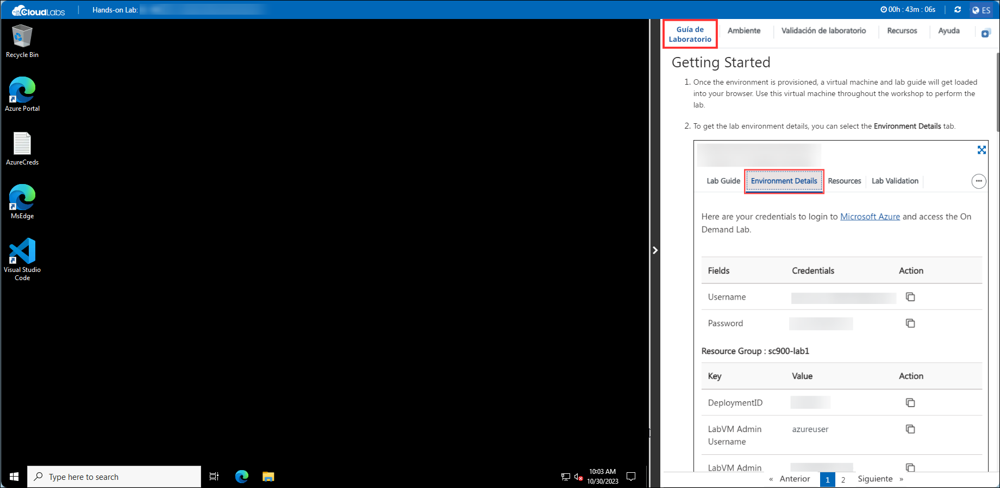
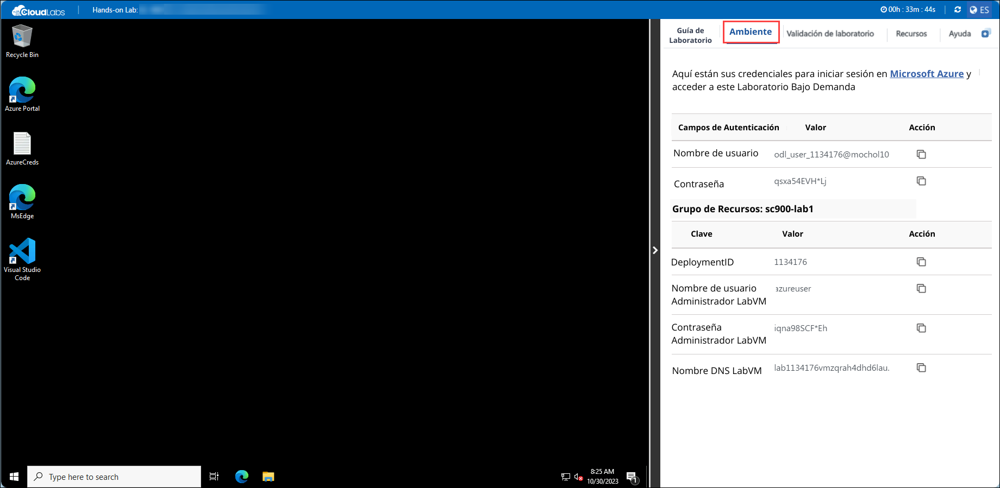
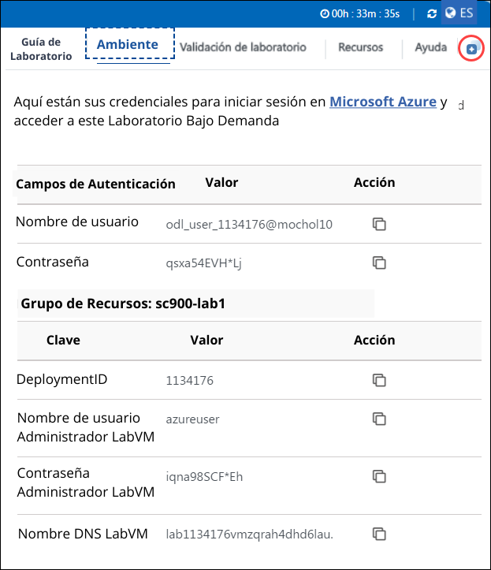
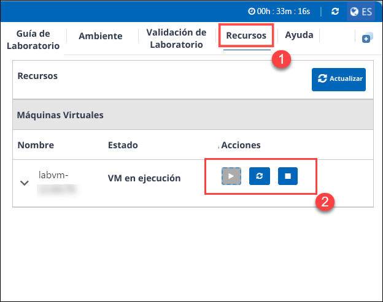
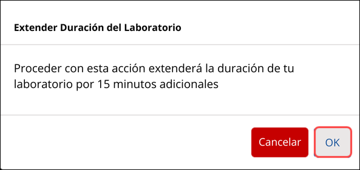
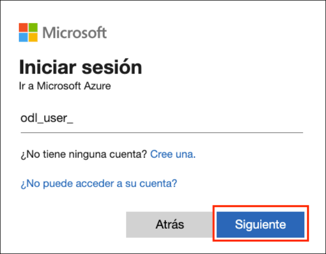
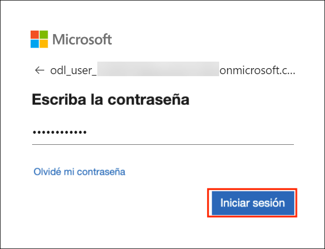

# Develop Generative AI solutions with Azure OpenAI Service

### Overall Estimated Duration: 4 Hours

## Overview

Azure OpenAI Service brings OpenAI's generative AI models to the Azure platform, enabling powerful AI solutions with Azure's security and scalability. In this lab, you'll learn to provision Azure OpenAI, deploy models using Azure OpenAI Studio, and create applications like chatbots and language models. You'll act as a developer implementing an app, learning how prompt engineering shapes AI responses. Additionally, you'll explore how the service can generate, debug, comment, and simplify code using natural language prompts.

## Objective

By the end of this lab, you will be able to:

- **Get started with the Azure OpenAI Service**: This hands-on exercise aims to teach you the fundamentals of using Azure OpenAI Service to integrate advanced AI models into your apps. You will set up and begin utilizing the Azure OpenAI Service to integrate AI models into the applications.

- **Use Azure OpenAI SDKs in your app**: This hands-on exercise demonstrates how to integrate Azure OpenAI SDKs into your application to improve AI capabilities. You will integrate and use Azure OpenAI SDKs within the application.

- **Utilize prompt engineering in your app**: This hands-on exercise demonstrates how to use prompt engineering methods to improve AI interactions in your application. You will use prompt engineering strategies to enhance the performance and relevance of AI.

- **Generate and improve code with Azure OpenAI Service**: The goal of this hands-on exercise is to demonstrate how to effectively generate and refine code using Azure OpenAI. You will improve your abilities to create and refine code with Azure OpenAI Service tools and approaches.
  
## Pre-requisites

- Familiarity with Azure OpenAI Service, Azure CLI, and REST APIs
- Basic Understanding of AI Concepts

## Architecture

The architecture flow for utilizing Azure OpenAI Service begins with provisioning the Azure OpenAI resource. Using Azure OpenAI Studio, you'll deploy and explore OpenAI models. As a developer, you'll create an app, interacting with Azure OpenAI APIs to process natural language prompts. This involves customizing and fine-tuning pre-trained models to meet specific needs. The models can also generate, debug, comment, and simplify code using natural language prompts, streamlining development and enhancing code quality. This flow covers provisioning resources, deploying models, and integrating them into practical applications.

## Architecture Diagram

   

## Explanation of Components

1. **Azure OpenAI**: Azure OpenAI Service provides REST API access to OpenAI's powerful language models and these models integrates with your data, enabling customized and secure interactions.
1. **Azure OpenAI Models**: Offers pre-trained and customizable large language models for various AI applications. These models allow for powerful AI-driven solutions by generating tailored and contextually relevant content based on well-crafted prompts.
1. **Azure CloudShell**: Azure CloudShell offers an integrated, browser-based shell experience for managing Azure resources. It provides a ready-to-use environment with pre-installed tools and access to both Bash and PowerShell.
1. **Prompt Engineering**: Use prompt engineering to craft clear prompts that guide Azure OpenAI models, ensuring they deliver accurate and relevant responses tailored to your app's needs.
1. **Generate Code**: Azure OpenAI Service can generate and debug code using natural language prompts, as well as simplify and improve existing code.

## Getting Started with the Lab
 
## Accessing Your Lab Environment
 
Once you're ready to dive in, your virtual machine and lab guide will be right at your fingertips within your web browser.

   

## Virtual Machine & Lab Guide
 
Your virtual machine is your workhorse throughout the workshop. The lab guide is your roadmap to success.
 
## Exploring Your Lab Resources
 
To get a better understanding of your lab resources and credentials, navigate to the **Environment** tab.
 
   
 
## Utilizing the Split Window Feature
 
For convenience, you can open the lab guide in a separate window by selecting the **Split Window** button from the Top right corner.
 
 
 
## Managing Your Virtual Machine
 
Feel free to start, stop, or restart your virtual machine as needed from the **Resources** tab. Your experience is in your hands!
 

## Lab Validation

1. After completing the task, hit the **Validate** button under Validation tab integrated within your lab guide. If you receive a success message, you can proceed to the next task, if not, carefully read the error message and retry the step, following the instructions in the lab guide.

   

1. You can also validate the task by navigating to the **Lab Validation** tab, from the upper right corner in the lab guide section.

   

1. If you need any assistance, please contact us at labs-support@spektrasystems.com.

## Lab Duration Extension

1. To extend the duration of the lab, kindly click the **Hourglass** icon in the top right corner of the lab environment. 

    

    >**Note:** You will get the **Hourglass** icon when 10 minutes are remaining in the lab.

2. Click **OK** to extend your lab duration.
 
   

3. If you have not extended the duration prior to when the lab is about to end, a pop-up will appear, giving you the option to extend. Click **OK** to proceed.

## Let's Get Started with Azure Portal

1. On your virtual machine, click on the Azure Portal icon as shown below:

   .png)
   
1. You'll see the **Sign into Microsoft Azure** tab. Here, enter your credentials:
 
   - **Email/Username:** <inject key="AzureAdUserEmail"></inject>
 
       
 
1. Next, provide your password:
 
   - **Password:** <inject key="AzureAdUserPassword"></inject>
 
       

1. If **Action required** pop-up window appears, click on **Ask later**.

   
    
1. If prompted to stay signed in, you can click "No."
 
1. If a **Welcome to Microsoft Azure** pop-up window appears, simply click "Maybe Later" to skip the tour.

1. Click "Next" from the bottom right corner to embark on your Lab journey!

   .png)

This hands-on-lab will help you with deploying models using Azure OpenAI Service, focusing on prompt engineering and exploring how the service simplifies code generation and debugging.

## Support Contact

The CloudLabs support team is available 24/7, 365 days a year, via email and live chat to ensure seamless assistance at any time. We offer dedicated support channels tailored specifically for both learners and instructors, ensuring that all your needs are promptly and efficiently addressed.

Learner Support Contacts:

- Email Support: labs-support@spektrasystems.com
- Live Chat Support: https://cloudlabs.ai/labs-support

Now, click on Next from the lower right corner to move on to the next page.

## Happy Learning!!
